## Imports


```python
from numpy import all, any, array, arctan2, cos, sin, exp, dot, log, logical_and, roll, sqrt, stack, trace, unravel_index, pi, deg2rad, rad2deg, where, zeros, floor, full, nan, isnan, round, float32
from numpy.linalg import det, lstsq, norm
from cv2 import resize, GaussianBlur, subtract, KeyPoint, INTER_LINEAR, INTER_NEAREST
from functools import cmp_to_key
import logging
import time
import numpy as np
import cv2
from matplotlib import pyplot as plt
```

## Function to compute the keypoints and descriptors 
### Parameters:
**image (the input image) <br>
sigma = 1.6<br>
num_intervals = 3<br>
assumed_blur = 0.5<br>
image_border_width = 5**<br>


```python

```


```python

```


```python

```


```python

```


```python
sigma = 1.6
num_intervals = 3
assumed_blur = 0.5
image_border_width = 5
```


```python
start_time = time.time()

def computeKeypointsAndDescriptors(image, sigma=1.6, num_intervals=3, assumed_blur=0.5, image_border_width=5):
    """Compute SIFT keypoints and descriptors for an input image
    """
    image = image.astype('float32')
    base_image = generateBaseImage(image, sigma, assumed_blur)
    num_octaves = computeNumberOfOctaves(base_image.shape)
    gaussian_kernels = generateGaussianKernels(sigma, num_intervals)
    gaussian_images = generateGaussianImages(base_image, num_octaves, gaussian_kernels)
    dog_images = generateDoGImages(gaussian_images)
    keypoints = findScaleSpaceExtrema(gaussian_images, dog_images, num_intervals, sigma, image_border_width)
    keypoints = removeDuplicateKeypoints(keypoints)
    keypoints = convertKeypointsToInputImageSize(keypoints)
    descriptors = generateDescriptors(keypoints, gaussian_images)
    return keypoints, descriptors
end_time = time.time()
elapsed_time = end_time - start_time

print("Time taken:", elapsed_time, "seconds")

```

    Time taken: 0.00045228004455566406 seconds


##### This is the Query Image 


```python
img1 = cv2.imread('box.png', cv2.IMREAD_GRAYSCALE)           # queryImage
```


```python

```


```python
image = img1.astype('float32')
```


```python

```


```python
plt.imshow(image, cmap='gray')
plt.show()
```


    
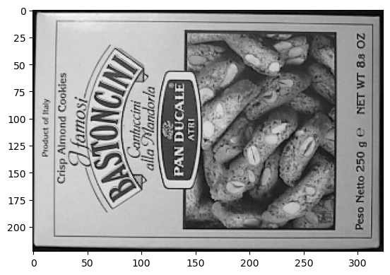
    


# Step #1
## Generating Base Image
### Parameters 
**image<br>
sigma<br>
assumed_blur**<br>


```python
def generateBaseImage(image, sigma, assumed_blur):
    """Generate base image from input image by upsampling by 2 in both directions and blurring
    """
    image = resize(image, (0, 0), fx=2, fy=2, interpolation=INTER_LINEAR)
    sigma_diff = sqrt(max((sigma ** 2) - ((2 * assumed_blur) ** 2), 0.01))
    return GaussianBlur(image, (0, 0), sigmaX=sigma_diff, sigmaY=sigma_diff)  # the image blur is now sigma instead of assumed_blur
```


```python
base_image = generateBaseImage(image, sigma, assumed_blur) #variable 1
```


```python
plt.imshow(base_image, cmap='gray')
plt.show()
```


    

    


# Step #2
## A) Compute the mumber of Octaves
### Parameters
**image shape**


```python
def computeNumberOfOctaves(image_shape):
    """Compute number of octaves in image pyramid as function of base image shape (OpenCV default)
    """
    return int(round(log(min(image_shape)) / log(2) - 1))
```


```python
image_shape = base_image.shape
```


```python
image_shape
```


    (446, 648)


```python
num_octaves = computeNumberOfOctaves(image_shape) #variable 2
```


```python
num_octaves
```


    8


```python

```

## B) Generate Gaussian Kernels
### Parameters :
**sigma<br>num_intervals<br>**


```python
def generateGaussianKernels(sigma, num_intervals):
    """Generate list of gaussian kernels at which to blur the input image. Default values of sigma, intervals, and octaves follow section 3 of Lowe's paper.
    """
    num_images_per_octave = num_intervals + 3
    k = 2 ** (1. / num_intervals)
    gaussian_kernels = zeros(num_images_per_octave)  # scale of gaussian blur necessary to go from one blur scale to the next within an octave
    gaussian_kernels[0] = sigma

    for image_index in range(1, num_images_per_octave):
        sigma_previous = (k ** (image_index - 1)) * sigma
        sigma_total = k * sigma_previous
        gaussian_kernels[image_index] = sqrt(sigma_total ** 2 - sigma_previous ** 2)
    return gaussian_kernels
```


```python
gaussian_kernels = generateGaussianKernels(sigma, num_intervals)  #variable 3
```


```python
gaussian_kernels
```


    array([1.6       , 1.2262735 , 1.54500779, 1.94658784, 2.452547  ,
           3.09001559])


```python

```

# Step 3
## Generating Gaussian Images
### Parameters: 
**base_image<br>
num_octaves<br>
gaussian_kernels**


```python
def generateGaussianImages(base_image, num_octaves, gaussian_kernels):
    """Generate scale-space pyramid of Gaussian images
    """
    gaussian_images = []

    for octave_index in range(num_octaves):
        gaussian_images_in_octave = []
        gaussian_images_in_octave.append(image)  # first image in octave already has the correct blur
        for gaussian_kernel in gaussian_kernels[1:]:
            image = GaussianBlur(image, (0, 0), sigmaX=gaussian_kernel, sigmaY=gaussian_kernel)
            gaussian_images_in_octave.append(image)
        gaussian_images.append(gaussian_images_in_octave)
        octave_base = gaussian_images_in_octave[-3]
        image = resize(octave_base, (int(octave_base.shape[1] / 2), int(octave_base.shape[0] / 2)), interpolation=INTER_NEAREST)
    return array(gaussian_images, dtype=object)
```


```python
gaussian_images = generateGaussianImages(base_image, num_octaves, gaussian_kernels) #Variable 4
```


```python
len(gaussian_images) * len(gaussian_images[0])
```


    48


```python
first_octave = gaussian_images[0]
```


```python
len(first_octave)
```


    6


```python
for i in first_octave:
    plt.imshow(i, cmap='gray')
    plt.show()
```


    

    


    

    


    
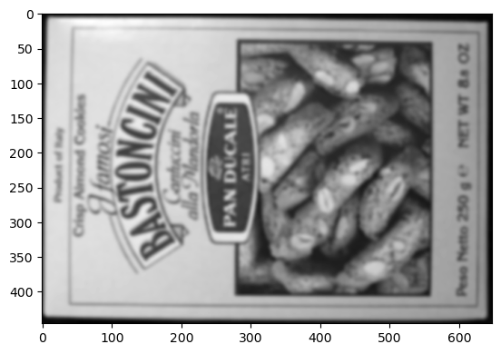
    


    
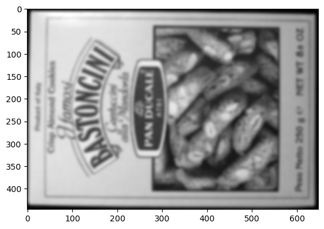
    


    

    


    

    


```python

```

# Step #4
## Generating DoG of Images
### Parameters:
**gaussian_images**


```python
def generateDoGImages(gaussian_images):
    """Generate Difference-of-Gaussians image pyramid
    """
    dog_images = []

    for gaussian_images_in_octave in gaussian_images:
        dog_images_in_octave = []
        for first_image, second_image in zip(gaussian_images_in_octave, gaussian_images_in_octave[1:]):
            dog_images_in_octave.append(subtract(second_image, first_image))  # ordinary subtraction will not work because the images are unsigned integers
        dog_images.append(dog_images_in_octave)
    return array(dog_images, dtype=object)
```


```python
dog_images = generateDoGImages(gaussian_images)  #variable 5
```


```python
len(dog_images) * len(dog_images[0])
```


    40


```python
first_octave_dog = dog_images[0]
```


```python
len(first_octave_dog)
```


    5


```python
for i in first_octave_dog:
    plt.imshow(i, cmap='gray')
    plt.show()
```


    
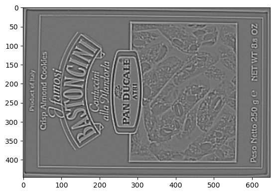
    


    
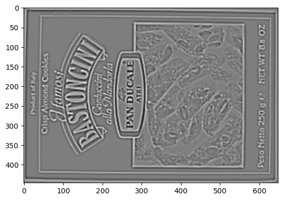
    


    
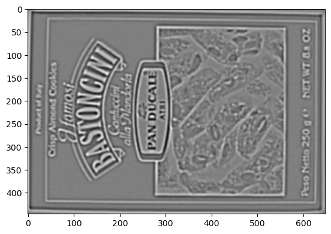
    


    
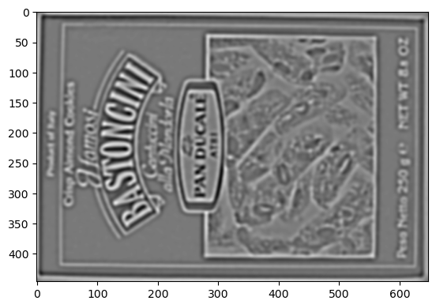
    


    
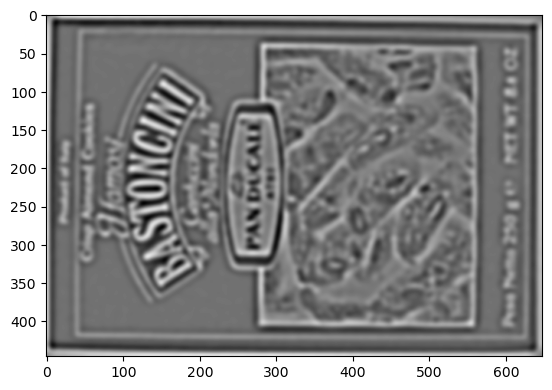
    


```python

```

# Step 6 
## Finding Keypoints using the scale space extrema
## Parameter: 
**gaussian_images<br>
dog_images<br>
num_intervals<br>
sigma<br>
image_border_width<br>**


```python
def findScaleSpaceExtrema(gaussian_images, dog_images, num_intervals, sigma, image_border_width, contrast_threshold=0.04):
    """Find pixel positions of all scale-space extrema in the image pyramid
    """
    threshold = floor(0.5 * contrast_threshold / num_intervals * 255)  # from OpenCV implementation
    keypoints = []

    for octave_index, dog_images_in_octave in enumerate(dog_images):
        for image_index, (first_image, second_image, third_image) in enumerate(zip(dog_images_in_octave, dog_images_in_octave[1:], dog_images_in_octave[2:])):
            # (i, j) is the center of the 3x3 array
            for i in range(image_border_width, first_image.shape[0] - image_border_width):
                for j in range(image_border_width, first_image.shape[1] - image_border_width):
                    if isPixelAnExtremum(first_image[i-1:i+2, j-1:j+2], second_image[i-1:i+2, j-1:j+2], third_image[i-1:i+2, j-1:j+2], threshold):
                        localization_result = localizeExtremumViaQuadraticFit(i, j, image_index + 1, octave_index, num_intervals, dog_images_in_octave, sigma, contrast_threshold, image_border_width)
                        if localization_result is not None:
                            keypoint, localized_image_index = localization_result
                            keypoints_with_orientations = computeKeypointsWithOrientations(keypoint, octave_index, gaussian_images[octave_index][localized_image_index])
                            for keypoint_with_orientation in keypoints_with_orientations:
                                keypoints.append(keypoint_with_orientation)
    return keypoints
```


```python

```


```python

```


```python

```

### to find scale space extrema we need 3 functions
#### isPixelAnExtremum ( )
#### computeKeypointsWithOrientations ( )
#### localizeExtremumViaQuadraticFit ( )


```python
def isPixelAnExtremum(first_subimage, second_subimage, third_subimage, threshold):
    """Return True if the center element of the 3x3x3 input array is strictly greater than or less than all its neighbors, False otherwise
    """
    center_pixel_value = second_subimage[1, 1]
    if abs(center_pixel_value) > threshold:
        if center_pixel_value > 0:
            return all(center_pixel_value >= first_subimage) and \
                   all(center_pixel_value >= third_subimage) and \
                   all(center_pixel_value >= second_subimage[0, :]) and \
                   all(center_pixel_value >= second_subimage[2, :]) and \
                   center_pixel_value >= second_subimage[1, 0] and \
                   center_pixel_value >= second_subimage[1, 2]
        elif center_pixel_value < 0:
            return all(center_pixel_value <= first_subimage) and \
                   all(center_pixel_value <= third_subimage) and \
                   all(center_pixel_value <= second_subimage[0, :]) and \
                   all(center_pixel_value <= second_subimage[2, :]) and \
                   center_pixel_value <= second_subimage[1, 0] and \
                   center_pixel_value <= second_subimage[1, 2]
    return False
```


```python
def computeKeypointsWithOrientations(keypoint, octave_index, gaussian_image, radius_factor=3, num_bins=36, peak_ratio=0.8, scale_factor=1.5):
    """Compute orientations for each keypoint
    """
    logger.debug('Computing keypoint orientations...')
    keypoints_with_orientations = []
    image_shape = gaussian_image.shape

    scale = scale_factor * keypoint.size / float32(2 ** (octave_index + 1))  # compare with keypoint.size computation in localizeExtremumViaQuadraticFit()
    radius = int(round(radius_factor * scale))
    weight_factor = -0.5 / (scale ** 2)
    raw_histogram = zeros(num_bins)
    smooth_histogram = zeros(num_bins)

    for i in range(-radius, radius + 1):
        region_y = int(round(keypoint.pt[1] / float32(2 ** octave_index))) + i
        if region_y > 0 and region_y < image_shape[0] - 1:
            for j in range(-radius, radius + 1):
                region_x = int(round(keypoint.pt[0] / float32(2 ** octave_index))) + j
                if region_x > 0 and region_x < image_shape[1] - 1:
                    dx = gaussian_image[region_y, region_x + 1] - gaussian_image[region_y, region_x - 1]
                    dy = gaussian_image[region_y - 1, region_x] - gaussian_image[region_y + 1, region_x]
                    gradient_magnitude = sqrt(dx * dx + dy * dy)
                    gradient_orientation = rad2deg(arctan2(dy, dx))
                    weight = exp(weight_factor * (i ** 2 + j ** 2))  # constant in front of exponential can be dropped because we will find peaks later
                    histogram_index = int(round(gradient_orientation * num_bins / 360.))
                    raw_histogram[histogram_index % num_bins] += weight * gradient_magnitude

    for n in range(num_bins):
        smooth_histogram[n] = (6 * raw_histogram[n] + 4 * (raw_histogram[n - 1] + raw_histogram[(n + 1) % num_bins]) + raw_histogram[n - 2] + raw_histogram[(n + 2) % num_bins]) / 16.
    orientation_max = max(smooth_histogram)
    orientation_peaks = where(logical_and(smooth_histogram > roll(smooth_histogram, 1), smooth_histogram > roll(smooth_histogram, -1)))[0]
    for peak_index in orientation_peaks:
        peak_value = smooth_histogram[peak_index]
        if peak_value >= peak_ratio * orientation_max:
            # Quadratic peak interpolation
            # The interpolation update is given by equation (6.30) in https://ccrma.stanford.edu/~jos/sasp/Quadratic_Interpolation_Spectral_Peaks.html
            left_value = smooth_histogram[(peak_index - 1) % num_bins]
            right_value = smooth_histogram[(peak_index + 1) % num_bins]
            interpolated_peak_index = (peak_index + 0.5 * (left_value - right_value) / (left_value - 2 * peak_value + right_value)) % num_bins
            orientation = 360. - interpolated_peak_index * 360. / num_bins
#             if abs(orientation - 360.) < float_tolerance:
#                 orientation = 0
            new_keypoint = KeyPoint(*keypoint.pt, keypoint.size, orientation, keypoint.response, keypoint.octave)
            keypoints_with_orientations.append(new_keypoint)
    return keypoints_with_orientations
```


```python
def localizeExtremumViaQuadraticFit(i, j, image_index, octave_index, num_intervals, dog_images_in_octave, sigma, contrast_threshold, image_border_width, eigenvalue_ratio=10, num_attempts_until_convergence=5):
    """Iteratively refine pixel positions of scale-space extrema via quadratic fit around each extremum's neighbors
    """
    logger.debug('Localizing scale-space extrema...')
    extremum_is_outside_image = False
    image_shape = dog_images_in_octave[0].shape
    for attempt_index in range(num_attempts_until_convergence):
        # need to convert from uint8 to float32 to compute derivatives and need to rescale pixel values to [0, 1] to apply Lowe's thresholds
        first_image, second_image, third_image = dog_images_in_octave[image_index-1:image_index+2]
        pixel_cube = stack([first_image[i-1:i+2, j-1:j+2],
                            second_image[i-1:i+2, j-1:j+2],
                            third_image[i-1:i+2, j-1:j+2]]).astype('float32') / 255.
        gradient = computeGradientAtCenterPixel(pixel_cube)
        hessian = computeHessianAtCenterPixel(pixel_cube)
        extremum_update = -lstsq(hessian, gradient, rcond=None)[0]
        if abs(extremum_update[0]) < 0.5 and abs(extremum_update[1]) < 0.5 and abs(extremum_update[2]) < 0.5:
            break
        j += int(round(extremum_update[0]))
        i += int(round(extremum_update[1]))
        image_index += int(round(extremum_update[2]))
        # make sure the new pixel_cube will lie entirely within the image
        if i < image_border_width or i >= image_shape[0] - image_border_width or j < image_border_width or j >= image_shape[1] - image_border_width or image_index < 1 or image_index > num_intervals:
            extremum_is_outside_image = True
            break
    if extremum_is_outside_image:
        logger.debug('Updated extremum moved outside of image before reaching convergence. Skipping...')
        return None
    if attempt_index >= num_attempts_until_convergence - 1:
        logger.debug('Exceeded maximum number of attempts without reaching convergence for this extremum. Skipping...')
        return None
    functionValueAtUpdatedExtremum = pixel_cube[1, 1, 1] + 0.5 * dot(gradient, extremum_update)
    if abs(functionValueAtUpdatedExtremum) * num_intervals >= contrast_threshold:
        xy_hessian = hessian[:2, :2]
        xy_hessian_trace = trace(xy_hessian)
        xy_hessian_det = det(xy_hessian)
        if xy_hessian_det > 0 and eigenvalue_ratio * (xy_hessian_trace ** 2) < ((eigenvalue_ratio + 1) ** 2) * xy_hessian_det:
            # Contrast check passed -- construct and return OpenCV KeyPoint object
            keypoint = KeyPoint()
            keypoint.pt = ((j + extremum_update[0]) * (2 ** octave_index), (i + extremum_update[1]) * (2 ** octave_index))
            keypoint.octave = octave_index + image_index * (2 ** 8) + int(round((extremum_update[2] + 0.5) * 255)) * (2 ** 16)
            keypoint.size = sigma * (2 ** ((image_index + extremum_update[2]) / float32(num_intervals))) * (2 ** (octave_index + 1))  # octave_index + 1 because the input image was doubled
            keypoint.response = abs(functionValueAtUpdatedExtremum)
            return keypoint, image_index
    return None
```

### For this localizeExtremumViaQuadraticFit we need 2 more functions
#### computeGradientAtCenterPixel ( )
#### computeHessianAtCenterPixel ( )


```python
def computeGradientAtCenterPixel(pixel_array):
    """Approximate gradient at center pixel [1, 1, 1] of 3x3x3 array using central difference formula of order O(h^2), where h is the step size
    """
    # With step size h, the central difference formula of order O(h^2) for f'(x) is (f(x + h) - f(x - h)) / (2 * h)
    # Here h = 1, so the formula simplifies to f'(x) = (f(x + 1) - f(x - 1)) / 2
    # NOTE: x corresponds to second array axis, y corresponds to first array axis, and s (scale) corresponds to third array axis
    dx = 0.5 * (pixel_array[1, 1, 2] - pixel_array[1, 1, 0])
    dy = 0.5 * (pixel_array[1, 2, 1] - pixel_array[1, 0, 1])
    ds = 0.5 * (pixel_array[2, 1, 1] - pixel_array[0, 1, 1])
    return array([dx, dy, ds])
```


```python
def computeHessianAtCenterPixel(pixel_array):
    """Approximate Hessian at center pixel [1, 1, 1] of 3x3x3 array using central difference formula of order O(h^2), where h is the step size
    """
    # With step size h, the central difference formula of order O(h^2) for f''(x) is (f(x + h) - 2 * f(x) + f(x - h)) / (h ^ 2)
    # Here h = 1, so the formula simplifies to f''(x) = f(x + 1) - 2 * f(x) + f(x - 1)
    # With step size h, the central difference formula of order O(h^2) for (d^2) f(x, y) / (dx dy) = (f(x + h, y + h) - f(x + h, y - h) - f(x - h, y + h) + f(x - h, y - h)) / (4 * h ^ 2)
    # Here h = 1, so the formula simplifies to (d^2) f(x, y) / (dx dy) = (f(x + 1, y + 1) - f(x + 1, y - 1) - f(x - 1, y + 1) + f(x - 1, y - 1)) / 4
    # NOTE: x corresponds to second array axis, y corresponds to first array axis, and s (scale) corresponds to third array axis
    center_pixel_value = pixel_array[1, 1, 1]
    dxx = pixel_array[1, 1, 2] - 2 * center_pixel_value + pixel_array[1, 1, 0]
    dyy = pixel_array[1, 2, 1] - 2 * center_pixel_value + pixel_array[1, 0, 1]
    dss = pixel_array[2, 1, 1] - 2 * center_pixel_value + pixel_array[0, 1, 1]
    dxy = 0.25 * (pixel_array[1, 2, 2] - pixel_array[1, 2, 0] - pixel_array[1, 0, 2] + pixel_array[1, 0, 0])
    dxs = 0.25 * (pixel_array[2, 1, 2] - pixel_array[2, 1, 0] - pixel_array[0, 1, 2] + pixel_array[0, 1, 0])
    dys = 0.25 * (pixel_array[2, 2, 1] - pixel_array[2, 0, 1] - pixel_array[0, 2, 1] + pixel_array[0, 0, 1])
    return array([[dxx, dxy, dxs], 
                  [dxy, dyy, dys],
                  [dxs, dys, dss]])
```


```python

```

## Finding keypoints 


```python

```


```python

```


```python
start_time = time.time()

keypoints = findScaleSpaceExtrema(gaussian_images, dog_images, num_intervals, sigma, image_border_width, contrast_threshold=0.04) 

end_time = time.time()
elapsed_time = end_time - start_time
print("Time taken:", elapsed_time, "seconds")
```

    Time taken: 0.0018360614776611328 seconds


```python
k1 = keypoints #variable 6a don't overwrite
```


```python
len(kp1)
```


    605


```python

```

### Processing on Keypoints
### 1 - Remove duplicates
### Parameters: 
**keypoints**


```python
def removeDuplicateKeypoints(keypoints):
    """Sort keypoints and remove duplicate keypoints
    """
    if len(keypoints) < 2:
        return keypoints

    keypoints.sort(key=cmp_to_key(compareKeypoints))
    unique_keypoints = [keypoints[0]]

    for next_keypoint in keypoints[1:]:
        last_unique_keypoint = unique_keypoints[-1]
        if last_unique_keypoint.pt[0] != next_keypoint.pt[0] or \
           last_unique_keypoint.pt[1] != next_keypoint.pt[1] or \
           last_unique_keypoint.size != next_keypoint.size or \
           last_unique_keypoint.angle != next_keypoint.angle:
            unique_keypoints.append(next_keypoint)
    return unique_keypoints
```


```python
keypoints = removeDuplicateKeypoints(keypoints) #variable 6b
```


```python
len(keypoints)
```


    603


```python

```


```python

```

#### ***Remove duplicate needs compare keypoints***


```python
def compareKeypoints(keypoint1, keypoint2):
    """Return True if keypoint1 is less than keypoint2
    """
    if keypoint1.pt[0] != keypoint2.pt[0]:
        return keypoint1.pt[0] - keypoint2.pt[0]
    if keypoint1.pt[1] != keypoint2.pt[1]:
        return keypoint1.pt[1] - keypoint2.pt[1]
    if keypoint1.size != keypoint2.size:
        return keypoint2.size - keypoint1.size
    if keypoint1.angle != keypoint2.angle:
        return keypoint1.angle - keypoint2.angle
    if keypoint1.response != keypoint2.response:
        return keypoint2.response - keypoint1.response
    if keypoint1.octave != keypoint2.octave:
        return keypoint2.octave - keypoint1.octave
    return keypoint2.class_id - keypoint1.class_id
```

***Convert the unique keypoints to the input image size***


```python
def convertKeypointsToInputImageSize(keypoints):
    """Convert keypoint point, size, and octave to input image size
    """
    converted_keypoints = []
    for keypoint in keypoints:
        keypoint.pt = tuple(0.5 * array(keypoint.pt))
        keypoint.size *= 0.5
        keypoint.octave = (keypoint.octave & ~255) | ((keypoint.octave - 1) & 255)
        converted_keypoints.append(keypoint)
    return converted_keypoints
```


```python
keypoints = convertKeypointsToInputImageSize(keypoints) #variable 6c
```


```python
len(keypoints)
```


    603


```python
kp1 = keypoints #change later 
```


```python
for k in kp1:
    print(k.response)
```

    0.09238334000110626
    0.09238334000110626
    0.08815503120422363
    0.08715565502643585
    0.08563870191574097
    0.08563870191574097
    0.08522165566682816
    0.08504282683134079
    0.08504282683134079
    0.08455156534910202
    0.08455156534910202
    0.0825607106089592
    0.0825607106089592
    0.08122989535331726
    0.0803903266787529
    0.0803903266787529
    0.07997222989797592
    0.07970576733350754
    0.07905539870262146
    0.07885874807834625
    0.07885874807834625
    0.07791188359260559
    0.07791188359260559
    0.07749750465154648
    0.07749750465154648
    0.07724548876285553
    0.0770936980843544
    0.07636433839797974
    0.07636433839797974
    0.07606631517410278
    0.07606631517410278
    0.07525262981653214
    0.07518000155687332
    0.07516218721866608
    0.07469943910837173
    0.07469943910837173
    0.07464630156755447
    0.07423929125070572
    0.07423929125070572
    0.073780357837677
    0.07347270101308823
    0.07347270101308823
    0.07336891442537308
    0.07268663495779037
    0.07237648218870163
    0.07237648218870163
    0.07192401587963104
    0.07065035402774811
    0.07028466463088989
    0.07028466463088989
    0.07004669308662415
    0.07004669308662415
    0.06859803944826126
    0.06859803944826126
    0.06783720850944519
    0.06769837439060211
    0.0673900842666626
    0.06637190282344818
    0.06637190282344818
    0.06635952740907669
    0.06604742258787155
    0.06598187237977982
    0.06598187237977982
    0.06575270742177963
    0.06469041854143143
    0.06469041854143143
    0.06440357863903046
    0.06431342661380768
    0.06430739909410477
    0.06415778398513794
    0.06415778398513794
    0.06409163773059845
    0.06409163773059845
    0.06365441530942917
    0.06347934156656265
    0.06347934156656265
    0.06340209394693375
    0.06336504966020584
    0.06336504966020584
    0.06311668455600739
    0.06287119537591934
    0.06228656694293022
    0.06218365207314491
    0.06217268481850624
    0.061974965035915375
    0.06184861809015274
    0.06184861809015274
    0.061417270451784134
    0.06118903309106827
    0.06103719770908356
    0.06103719770908356
    0.0610201433300972
    0.0610201433300972
    0.060515984892845154
    0.06049492210149765
    0.06049492210149765
    0.0602954737842083
    0.0602954737842083
    0.060165904462337494
    0.05975212901830673
    0.05975212901830673
    0.05969291552901268
    0.059682827442884445
    0.059682827442884445
    0.05934387072920799
    0.05871250107884407
    0.05853793025016785
    0.05853793025016785
    0.05831078439950943
    0.058301690965890884
    0.058147888630628586
    0.05791335552930832
    0.05791335552930832
    0.05739079788327217
    0.057159725576639175
    0.05611380189657211
    0.055309128016233444
    0.05514359101653099
    0.054374631494283676
    0.05436134710907936
    0.054357659071683884
    0.054357659071683884
    0.054258719086647034
    0.054258719086647034
    0.0538174994289875
    0.053695134818553925
    0.053695134818553925
    0.053501714020967484
    0.053486064076423645
    0.05348393693566322
    0.05348393693566322
    0.0533531978726387
    0.05335274711251259
    0.05334830656647682
    0.05334830656647682
    0.052852679044008255
    0.052852679044008255
    0.05250712111592293
    0.05250712111592293
    0.051827434450387955
    0.05171802639961243
    0.05170537531375885
    0.05143521726131439
    0.05143521726131439
    0.05129758641123772
    0.05082327499985695
    0.050652358680963516
    0.050652358680963516
    0.050383251160383224
    0.050383251160383224
    0.05025189369916916
    0.049934666603803635
    0.04960406944155693
    0.04941176250576973
    0.0491524301469326
    0.04903842881321907
    0.04878351837396622
    0.04867343232035637
    0.048463914543390274
    0.0483989417552948
    0.0483989417552948
    0.048010095953941345
    0.048010095953941345
    0.04789908230304718
    0.047285255044698715
    0.04727117344737053
    0.04706892371177673
    0.046912893652915955
    0.04688560590147972
    0.046852998435497284
    0.04674582555890083
    0.046532195061445236
    0.046532195061445236
    0.046523794531822205
    0.04638425260782242
    0.04638425260782242
    0.046123798936605453
    0.046123798936605453
    0.04609786719083786
    0.04605427384376526
    0.04605427384376526
    0.04590315371751785
    0.04582477733492851
    0.04561185836791992
    0.0454629622399807
    0.045315518975257874
    0.04516981169581413
    0.04516981169581413
    0.04510420188307762
    0.04443274810910225
    0.0444047711789608
    0.0444047711789608
    0.04407912492752075
    0.044054560363292694
    0.044054560363292694
    0.04394179582595825
    0.043838609009981155
    0.043838609009981155
    0.043443579226732254
    0.04330859333276749
    0.04327676445245743
    0.04327160865068436
    0.04327160865068436
    0.04312370717525482
    0.042976703494787216
    0.04283514618873596
    0.04280981048941612
    0.04280981048941612
    0.04248637333512306
    0.04248637333512306
    0.042480792850255966
    0.04234253242611885
    0.04234253242611885
    0.04234253242611885
    0.04232267290353775
    0.04220321774482727
    0.041919220238924026
    0.04180469363927841
    0.04180469363927841
    0.04171565920114517
    0.0415264256298542
    0.04145338013768196
    0.04100324586033821
    0.040847048163414
    0.04065393656492233
    0.04060986638069153
    0.040586475282907486
    0.04048687964677811
    0.04048687964677811
    0.04033307731151581
    0.04033307731151581
    0.040244877338409424
    0.040244877338409424
    0.03984055668115616
    0.03984055668115616
    0.03980802744626999
    0.03980802744626999
    0.039478667080402374
    0.03944434970617294
    0.039383530616760254
    0.03933548182249069
    0.03928873687982559
    0.039068784564733505
    0.038918014615774155
    0.03875074163079262
    0.03859645500779152
    0.03858621045947075
    0.03854553401470184
    0.0385451577603817
    0.038370683789253235
    0.038038220256567
    0.038038220256567
    0.03800761699676514
    0.03788687661290169
    0.03788687661290169
    0.037862133234739304
    0.037862133234739304
    0.03770798072218895
    0.03756304085254669
    0.037502121180295944
    0.03744379058480263
    0.036946527659893036
    0.036785613745450974
    0.03677515685558319
    0.03660621866583824
    0.03645956888794899
    0.03634465113282204
    0.036275383085012436
    0.03624240309000015
    0.035880740731954575
    0.035880740731954575
    0.03583994135260582
    0.03583994135260582
    0.03582797944545746
    0.035784680396318436
    0.0357784740626812
    0.0357784740626812
    0.035677310079336166
    0.035417936742305756
    0.035417936742305756
    0.03537862375378609
    0.03537862375378609
    0.03535250201821327
    0.03530159220099449
    0.03523324429988861
    0.035194989293813705
    0.03506261482834816
    0.03500395640730858
    0.03491813316941261
    0.03491813316941261
    0.034622177481651306
    0.034509122371673584
    0.034498609602451324
    0.03448520973324776
    0.0344620980322361
    0.034414902329444885
    0.03439997509121895
    0.03431231901049614
    0.0343085415661335
    0.03427909314632416
    0.034217361360788345
    0.034217361360788345
    0.03418339043855667
    0.03413069248199463
    0.034088827669620514
    0.03402470797300339
    0.03402470797300339
    0.033889688551425934
    0.033889688551425934
    0.033802736550569534
    0.03376726433634758
    0.03345392271876335
    0.033367566764354706
    0.03334524855017662
    0.03329887241125107
    0.033123135566711426
    0.033123135566711426
    0.03306514769792557
    0.03301089629530907
    0.03300917148590088
    0.03300734609365463
    0.03300734609365463
    0.032897353172302246
    0.032833218574523926
    0.032597217708826065
    0.03247811272740364
    0.03247811272740364
    0.032437652349472046
    0.032437652349472046
    0.03231613337993622
    0.032254695892333984
    0.032243769615888596
    0.03214268758893013
    0.03182341903448105
    0.03179938346147537
    0.03174791857600212
    0.03174133598804474
    0.03171016275882721
    0.03168113902211189
    0.031615447252988815
    0.031517669558525085
    0.03151760622859001
    0.03137248009443283
    0.031333375722169876
    0.03122754767537117
    0.031200433149933815
    0.031200433149933815
    0.0310429148375988
    0.0310429148375988
    0.031041501089930534
    0.03102337010204792
    0.03102337010204792
    0.031021911650896072
    0.030978472903370857
    0.030961818993091583
    0.03087787888944149
    0.030874095857143402
    0.03087358921766281
    0.03087358921766281
    0.03085358813405037
    0.030836327001452446
    0.030649900436401367
    0.030638402327895164
    0.030623843893408775
    0.030420733615756035
    0.030420733615756035
    0.030357543379068375
    0.030239468440413475
    0.030239468440413475
    0.03020317666232586
    0.030034983530640602
    0.029866961762309074
    0.029780374839901924
    0.029721243306994438
    0.029700586572289467
    0.02966178208589554
    0.029591569676995277
    0.029467042535543442
    0.02944345213472843
    0.02939555048942566
    0.029375212267041206
    0.029242785647511482
    0.029170097783207893
    0.029170097783207893
    0.0291636660695076
    0.0291634202003479
    0.02914704568684101
    0.028958721086382866
    0.028929036110639572
    0.02892143279314041
    0.028886236250400543
    0.028718892484903336
    0.028718892484903336
    0.028690414503216743
    0.028655461966991425
    0.028540311381220818
    0.02844076417386532
    0.028324587270617485
    0.028225980699062347
    0.02813025191426277
    0.02806878462433815
    0.027994241565465927
    0.027955198660492897
    0.027768129482865334
    0.027768129482865334
    0.027768129482865334
    0.027704354375600815
    0.02761039137840271
    0.027522316202521324
    0.02742191217839718
    0.02741290256381035
    0.027284948155283928
    0.027104364708065987
    0.027101418003439903
    0.02705652080476284
    0.026878084987401962
    0.026861608028411865
    0.026730796322226524
    0.026585429906845093
    0.02635134384036064
    0.026319287717342377
    0.026103803887963295
    0.026012256741523743
    0.025973742827773094
    0.025891177356243134
    0.025885237380862236
    0.02578701078891754
    0.0256473571062088
    0.025640791282057762
    0.025543658062815666
    0.02543998323380947
    0.02543998323380947
    0.02540971152484417
    0.02539804019033909
    0.02537660300731659
    0.02537660300731659
    0.025358159095048904
    0.025342147797346115
    0.02514735423028469
    0.025135420262813568
    0.02509068325161934
    0.024991285055875778
    0.02491014637053013
    0.024789227172732353
    0.02475757710635662
    0.02474069409072399
    0.02474069409072399
    0.024740371853113174
    0.024704327806830406
    0.02458559349179268
    0.02455681934952736
    0.02452377788722515
    0.024452457204461098
    0.024452457204461098
    0.02411160059273243
    0.024021612480282784
    0.024021612480282784
    0.023958666250109673
    0.02395489439368248
    0.023784007877111435
    0.02355925552546978
    0.023529410362243652
    0.02348426729440689
    0.02348426729440689
    0.023474914953112602
    0.023438775911927223
    0.023420384153723717
    0.023420384153723717
    0.023420384153723717
    0.02297482267022133
    0.022916942834854126
    0.022874053567647934
    0.022874053567647934
    0.02265750989317894
    0.022642573341727257
    0.02255783975124359
    0.022525066509842873
    0.02233799174427986
    0.022226491943001747
    0.021975288167595863
    0.02170056849718094
    0.02158438041806221
    0.02148345671594143
    0.02147584781050682
    0.021423228085041046
    0.021354854106903076
    0.021343596279621124
    0.021321166306734085
    0.021321166306734085
    0.021268757060170174
    0.02110464870929718
    0.02107076160609722
    0.021043382585048676
    0.020794231444597244
    0.020784229040145874
    0.02074907161295414
    0.020734187215566635
    0.020658737048506737
    0.02053036168217659
    0.02053036168217659
    0.020513586699962616
    0.020479917526245117
    0.02042417787015438
    0.020417694002389908
    0.02033068984746933
    0.020303064957261086
    0.02026626467704773
    0.020265191793441772
    0.020256131887435913
    0.020256131887435913
    0.020206645131111145
    0.020078005269169807
    0.020058032125234604
    0.0199379101395607
    0.019876379519701004
    0.019832095131278038
    0.01971897855401039
    0.019634682685136795
    0.019161244854331017
    0.019136957824230194
    0.019136957824230194
    0.01906450279057026
    0.01897541806101799
    0.01897541806101799
    0.018815573304891586
    0.01866874098777771
    0.018569914624094963
    0.01847219467163086
    0.018235115334391594
    0.018200555816292763
    0.01814752258360386
    0.018095728009939194
    0.01806889846920967
    0.018030593171715736
    0.018030593171715736
    0.017956456169486046
    0.017948970198631287
    0.017787422984838486
    0.017787422984838486
    0.01758684776723385
    0.01758684776723385
    0.017491856589913368
    0.017456134781241417
    0.017323940992355347
    0.017323940992355347
    0.017229491844773293
    0.017142901197075844
    0.016932031139731407
    0.01678411290049553
    0.01673487015068531
    0.01672811433672905
    0.01656944863498211
    0.016478998586535454
    0.0163994450122118
    0.01618153788149357
    0.016155220568180084
    0.01609203591942787
    0.016056617721915245
    0.016056617721915245
    0.016040582209825516
    0.01602955535054207
    0.016022540628910065
    0.0159450750797987
    0.01581973396241665
    0.01570584438741207
    0.01570584438741207
    0.01558817457407713
    0.015491451136767864
    0.015484322793781757
    0.015463313087821007
    0.015431033447384834
    0.015382365323603153
    0.015350955538451672
    0.015251757577061653
    0.015148967504501343
    0.01509170513600111
    0.01509170513600111
    0.015035208314657211
    0.01494139339774847
    0.014916177839040756
    0.014899716712534428
    0.01477543544024229
    0.01477543544024229
    0.014751012437045574
    0.01473019365221262
    0.014343244023621082
    0.014326278120279312
    0.014305401593446732
    0.014303818345069885
    0.014303818345069885
    0.014197404496371746
    0.014197404496371746
    0.014159373939037323
    0.014159373939037323
    0.014104579575359821
    0.014022166840732098
    0.014011450111865997
    0.01385340467095375
    0.013771362602710724
    0.01373129989951849
    0.013573165982961655
    0.013459887355566025
    0.013450859114527702


```python
len(testk)
```


    603


```python
testk = kp1
```


```python
# for k in testk:
#     print(k.pt)
```


```python
   # Sort the keypoints by their response value (strength of the detected feature)
testk.sort(key=lambda x: x.response, reverse=True)
nms_distance = 10
    # Use non-maximum suppression to eliminate redundant keypoints
test_selected_keypoints = []
for keypoint in testk:
    is_overlap = False
    for selected_keypoint in test_selected_keypoints:
        if abs(keypoint.pt[0] - selected_keypoint.pt[0]) < nms_distance and abs(keypoint.pt[1] - selected_keypoint.pt[1]) < nms_distance:
            is_overlap = True
            break
    if not is_overlap:
        test_selected_keypoints.append(keypoint)
```

    132.97149658203125 146.54379272460938
    132.97149658203125 146.54379272460938
    55.94916534423828 92.93437194824219
    132.5989532470703 132.94033813476562
    63.33987808227539 77.65325164794922
    70.24345397949219 53.004119873046875
    136.6270294189453 117.47686767578125
    73.7264175415039 113.58872985839844
    132.96023559570312 81.24784088134766
    136.6270294189453 117.47686767578125
    132.96023559570312 81.24784088134766
    132.97149658203125 146.54379272460938
    132.97149658203125 146.54379272460938
    86.27165985107422 70.31159210205078
    76.91571807861328 84.4649429321289
    136.6270294189453 117.47686767578125
    132.5989532470703 132.94033813476562
    132.5989532470703 132.94033813476562
    77.48324584960938 137.81439208984375
    73.7264175415039 113.58872985839844
    132.96023559570312 81.24784088134766
    84.49282836914062 149.58570861816406
    64.7103042602539 158.44276428222656
    84.49282836914062 149.58570861816406
    136.6270294189453 117.47686767578125
    136.6270294189453 117.47686767578125
    55.94916534423828 92.93437194824219
    77.07879638671875 169.0350341796875
    58.235755920410156 141.61648559570312
    132.97149658203125 146.54379272460938
    88.75537872314453 161.11741638183594
    132.96023559570312 81.24784088134766
    132.96023559570312 81.24784088134766
    57.504154205322266 113.95726776123047
    77.48324584960938 137.81439208984375
    86.27165985107422 70.31159210205078
    70.24345397949219 53.004119873046875
    73.7264175415039 113.58872985839844
    73.7264175415039 113.58872985839844
    132.96023559570312 81.24784088134766
    86.27165985107422 70.31159210205078
    86.27165985107422 70.31159210205078
    86.27165985107422 70.31159210205078
    136.6270294189453 117.47686767578125
    136.6270294189453 117.47686767578125
    52.69459915161133 126.69039916992188
    70.24345397949219 53.004119873046875
    76.91571807861328 84.4649429321289
    142.02658081054688 20.65104103088379
    58.235755920410156 141.61648559570312
    58.235755920410156 141.61648559570312
    77.48324584960938 137.81439208984375
    93.6583480834961 56.69961929321289
    73.7264175415039 113.58872985839844
    77.48324584960938 137.81439208984375
    77.48324584960938 137.81439208984375
    63.33987808227539 77.65325164794922
    70.24345397949219 53.004119873046875
    58.235755920410156 141.61648559570312
    77.07879638671875 169.0350341796875
    93.6583480834961 56.69961929321289
    93.6583480834961 56.69961929321289
    136.65452575683594 106.91676330566406
    145.38453674316406 61.616050720214844
    86.27165985107422 70.31159210205078
    86.27165985107422 70.31159210205078
    132.96023559570312 81.24784088134766
    132.96023559570312 81.24784088134766
    52.69459915161133 126.69039916992188
    6.894546985626221 6.163369655609131
    84.49282836914062 149.58570861816406
    84.49282836914062 149.58570861816406
    77.48324584960938 137.81439208984375
    144.69073486328125 197.59498596191406
    63.33987808227539 77.65325164794922
    277.4375 201.4742431640625
    76.91571807861328 84.4649429321289
    44.231536865234375 97.01318359375
    52.69459915161133 126.69039916992188
    84.49282836914062 149.58570861816406
    77.48324584960938 137.81439208984375
    77.48324584960938 137.81439208984375
    77.48324584960938 137.81439208984375
    88.75537872314453 161.11741638183594
    58.235755920410156 141.61648559570312
    136.65452575683594 106.91676330566406
    63.33987808227539 77.65325164794922
    226.46896362304688 75.01227569580078
    96.33372497558594 103.63082122802734
    303.3218688964844 32.32467269897461
    57.504154205322266 113.95726776123047
    57.504154205322266 113.95726776123047
    238.47982788085938 198.4216766357422
    132.97149658203125 146.54379272460938
    279.46990966796875 157.2464599609375
    318.87139892578125 7.954229831695557
    303.3218688964844 32.32467269897461
    303.3218688964844 32.32467269897461
    76.91571807861328 84.4649429321289
    76.91571807861328 84.4649429321289
    55.94916534423828 92.93437194824219
    132.97149658203125 146.54379272460938
    57.504154205322266 113.95726776123047
    93.6583480834961 56.69961929321289
    93.6583480834961 56.69961929321289
    86.27165985107422 70.31159210205078
    119.55416107177734 115.11228942871094
    184.64842224121094 55.84591293334961
    318.87139892578125 7.954229831695557
    318.87139892578125 7.954229831695557
    73.7264175415039 113.58872985839844
    77.07879638671875 169.0350341796875
    58.235755920410156 141.61648559570312
    55.94916534423828 92.93437194824219
    77.48324584960938 137.81439208984375
    26.42401695251465 156.61659240722656
    304.34918212890625 93.38124084472656
    58.235755920410156 141.61648559570312
    55.94916534423828 92.93437194824219
    70.24345397949219 53.004119873046875
    216.58642578125 28.606340408325195
    136.65452575683594 106.91676330566406
    52.69459915161133 126.69039916992188
    52.69459915161133 126.69039916992188
    270.9451599121094 134.81517028808594
    127.1026840209961 66.162353515625
    162.7247772216797 111.45915985107422
    145.38453674316406 61.616050720214844
    70.24345397949219 53.004119873046875
    162.7247772216797 111.45915985107422
    162.7247772216797 111.45915985107422
    127.1026840209961 66.162353515625
    164.61805725097656 77.96741485595703
    279.60809326171875 22.067058563232422
    279.60809326171875 22.067058563232422
    166.97866821289062 176.801025390625
    277.57183837890625 54.299957275390625
    164.61805725097656 77.96741485595703
    81.70018005371094 43.35587692260742
    70.24345397949219 53.004119873046875
    274.61834716796875 171.2023162841797
    84.49282836914062 149.58570861816406
    113.73737335205078 92.12541961669922
    255.37315368652344 146.64724731445312
    302.80816650390625 43.16278076171875
    302.80816650390625 43.16278076171875
    302.80816650390625 43.16278076171875
    164.61805725097656 77.96741485595703
    164.61805725097656 77.96741485595703
    55.94916534423828 92.93437194824219
    254.69265747070312 126.5261459350586
    205.68881225585938 43.270015716552734
    274.61834716796875 171.2023162841797
    166.97866821289062 176.801025390625
    229.27613830566406 24.04975128173828
    226.46896362304688 75.01227569580078
    226.46896362304688 75.01227569580078
    202.99745178222656 155.90640258789062
    12.151715278625488 115.24763488769531
    11.613472938537598 98.13890075683594
    208.26658630371094 87.114990234375
    274.61834716796875 171.2023162841797
    145.38453674316406 61.616050720214844
    70.24345397949219 53.004119873046875
    223.88238525390625 53.29011154174805
    223.88238525390625 53.29011154174805
    254.69265747070312 126.5261459350586
    240.44830322265625 116.5779037475586
    240.44830322265625 116.5779037475586
    176.3671417236328 114.97464752197266
    247.99195861816406 46.90805435180664
    247.99195861816406 46.90805435180664
    52.69459915161133 126.69039916992188
    52.69459915161133 126.69039916992188
    11.613472938537598 98.13890075683594
    132.5989532470703 132.94033813476562
    205.68881225585938 43.270015716552734
    229.27613830566406 24.04975128173828
    164.61805725097656 77.96741485595703
    186.0995635986328 127.45716094970703
    164.61805725097656 77.96741485595703
    57.504154205322266 113.95726776123047
    113.4695053100586 131.75120544433594
    181.91648864746094 41.70439529418945
    254.69265747070312 126.5261459350586
    277.5381164550781 98.4896469116211
    11.613472938537598 98.13890075683594
    11.613472938537598 98.13890075683594
    186.0995635986328 127.45716094970703
    113.4695053100586 131.75120544433594
    113.4695053100586 131.75120544433594
    208.26658630371094 87.114990234375
    208.26658630371094 87.114990234375
    176.3671417236328 114.97464752197266
    204.1207275390625 134.83120727539062
    202.99745178222656 155.90640258789062
    77.07879638671875 169.0350341796875
    77.07879638671875 169.0350341796875
    77.07879638671875 169.0350341796875
    26.42401695251465 156.61659240722656
    132.96023559570312 81.24784088134766
    166.97866821289062 176.801025390625
    254.69265747070312 126.5261459350586
    12.151715278625488 115.24763488769531
    12.151715278625488 115.24763488769531
    140.39971923828125 166.0664825439453
    185.870361328125 181.95648193359375
    96.03369140625 87.42403411865234
    217.9930419921875 154.5277862548828
    279.46990966796875 157.2464599609375
    230.18707275390625 127.66218566894531
    229.27613830566406 24.04975128173828
    259.1879577636719 165.25271606445312
    229.27613830566406 24.04975128173828
    181.91648864746094 41.70439529418945
    238.08705139160156 183.35255432128906
    199.27508544921875 106.88936614990234
    275.5373840332031 42.99006652832031
    277.5381164550781 98.4896469116211
    216.58642578125 28.606340408325195
    113.4695053100586 131.75120544433594
    113.4695053100586 131.75120544433594
    132.96023559570312 81.24784088134766
    132.96023559570312 81.24784088134766
    240.44830322265625 116.5779037475586
    27.100255966186523 96.71139526367188
    31.465211868286133 139.42079162597656
    244.33949279785156 159.18792724609375
    277.57183837890625 54.299957275390625
    100.87926483154297 113.87895965576172
    223.84646606445312 114.47576141357422
    229.27613830566406 24.04975128173828
    31.465211868286133 139.42079162597656
    186.0995635986328 127.45716094970703
    96.33372497558594 103.63082122802734
    254.69265747070312 126.5261459350586
    240.44830322265625 116.5779037475586
    204.1207275390625 134.83120727539062
    27.100255966186523 96.71139526367188
    27.100255966186523 96.71139526367188
    202.99745178222656 155.90640258789062
    202.99745178222656 155.90640258789062
    193.19432067871094 96.63262939453125
    117.923828125 37.31727981567383
    229.27613830566406 24.04975128173828
    96.33372497558594 103.63082122802734
    136.6270294189453 117.47686767578125
    270.9451599121094 134.81517028808594
    136.6270294189453 117.47686767578125
    136.6270294189453 117.47686767578125
    113.73737335205078 92.12541961669922
    277.5381164550781 98.4896469116211
    186.0995635986328 127.45716094970703
    113.4695053100586 131.75120544433594
    113.4695053100586 131.75120544433594
    166.97866821289062 176.801025390625
    166.97866821289062 176.801025390625
    273.0587158203125 88.48138427734375
    180.6726837158203 70.83100891113281
    142.02658081054688 20.65104103088379
    31.465211868286133 139.42079162597656
    136.65452575683594 106.91676330566406
    186.0995635986328 127.45716094970703
    259.1879577636719 165.25271606445312
    96.03369140625 87.42403411865234
    96.03369140625 87.42403411865234
    229.06822204589844 165.89744567871094
    230.18707275390625 127.66218566894531
    180.6726837158203 70.83100891113281
    96.33372497558594 103.63082122802734
    172.18655395507812 90.70816802978516
    172.18655395507812 90.70816802978516
    217.9930419921875 154.5277862548828
    166.97866821289062 176.801025390625
    255.37315368652344 146.64724731445312
    229.06822204589844 165.89744567871094
    186.0995635986328 127.45716094970703
    226.46896362304688 75.01227569580078
    23.801437377929688 78.18048858642578
    226.46896362304688 75.01227569580078
    184.64842224121094 55.84591293334961
    223.84646606445312 114.47576141357422
    223.84646606445312 114.47576141357422
    223.84646606445312 114.47576141357422
    40.05213165283203 121.87600708007812
    136.6270294189453 117.47686767578125
    180.6726837158203 70.83100891113281
    164.61805725097656 77.96741485595703
    96.33372497558594 103.63082122802734
    187.33155822753906 165.28570556640625
    200.23252868652344 193.17832946777344
    229.06822204589844 165.89744567871094
    240.2087860107422 144.8375244140625
    31.465211868286133 139.42079162597656
    234.47740173339844 103.46842193603516
    210.6911163330078 104.19149017333984
    162.7247772216797 111.45915985107422
    113.4695053100586 131.75120544433594
    247.99195861816406 46.90805435180664
    186.0995635986328 127.45716094970703
    302.77642822265625 162.1287078857422
    113.73737335205078 92.12541961669922
    31.465211868286133 139.42079162597656
    165.64401245117188 45.001304626464844
    223.55189514160156 199.97039794921875
    274.61834716796875 171.2023162841797
    26.42401695251465 156.61659240722656
    202.99745178222656 155.90640258789062
    160.35275268554688 148.55384826660156
    200.23252868652344 193.17832946777344
    302.77642822265625 162.1287078857422
    302.77642822265625 162.1287078857422
    119.55416107177734 115.11228942871094
    160.35275268554688 148.55384826660156
    113.4695053100586 131.75120544433594
    145.38453674316406 61.616050720214844
    277.5381164550781 98.4896469116211
    119.55416107177734 115.11228942871094
    119.55416107177734 115.11228942871094
    119.55416107177734 115.11228942871094
    64.7103042602539 158.44276428222656
    64.7103042602539 158.44276428222656
    254.2339630126953 199.56396484375
    256.7552795410156 75.66361236572266
    96.33372497558594 103.63082122802734
    159.33522033691406 25.046310424804688
    70.24345397949219 53.004119873046875
    70.24345397949219 53.004119873046875
    247.99195861816406 46.90805435180664
    259.1879577636719 165.25271606445312
    211.21278381347656 196.3360595703125
    211.21278381347656 196.3360595703125
    211.21278381347656 196.3360595703125
    179.6979217529297 143.2962646484375
    108.79840087890625 144.5520477294922
    179.6979217529297 143.2962646484375
    179.6979217529297 143.2962646484375
    27.100255966186523 96.71139526367188
    181.91648864746094 41.70439529418945
    11.613472938537598 98.13890075683594
    160.35275268554688 148.55384826660156
    165.64401245117188 45.001304626464844
    184.64842224121094 55.84591293334961
    226.46896362304688 75.01227569580078
    303.3218688964844 32.32467269897461
    277.4375 201.4742431640625
    96.07445526123047 144.46385192871094
    303.3050231933594 56.604156494140625
    216.58642578125 28.606340408325195
    132.96023559570312 81.24784088134766
    12.151715278625488 115.24763488769531
    156.29043579101562 186.03379821777344
    40.05213165283203 121.87600708007812
    193.19432067871094 96.63262939453125
    108.84772491455078 75.20771789550781
    12.151715278625488 115.24763488769531
    12.151715278625488 115.24763488769531
    96.03369140625 87.42403411865234
    12.151715278625488 115.24763488769531
    216.58642578125 28.606340408325195
    162.7247772216797 111.45915985107422
    193.63755798339844 22.03084945678711
    250.72747802734375 182.71463012695312
    200.23252868652344 193.17832946777344
    200.23252868652344 193.17832946777344
    238.47982788085938 198.4216766357422
    208.26658630371094 87.114990234375
    216.58642578125 28.606340408325195
    211.21278381347656 196.3360595703125
    255.96791076660156 25.513063430786133
    217.9930419921875 154.5277862548828
    217.9930419921875 154.5277862548828
    265.7971496582031 195.7764129638672
    275.5373840332031 42.99006652832031
    226.46896362304688 75.01227569580078
    200.23252868652344 193.17832946777344
    200.23252868652344 193.17832946777344
    176.3671417236328 114.97464752197266
    242.53941345214844 23.776704788208008
    303.4429931640625 184.67718505859375
    303.3218688964844 32.32467269897461
    303.3218688964844 32.32467269897461
    303.6828308105469 69.3386459350586
    205.50794982910156 24.319284439086914
    12.151715278625488 115.24763488769531
    12.151715278625488 115.24763488769531
    172.18655395507812 90.70816802978516
    172.18655395507812 90.70816802978516
    223.88238525390625 53.29011154174805
    143.08299255371094 180.9664306640625
    11.613472938537598 98.13890075683594
    11.613472938537598 98.13890075683594
    303.3050231933594 56.604156494140625
    301.1693115234375 200.18563842773438
    277.5381164550781 98.4896469116211
    279.46990966796875 157.2464599609375
    11.613472938537598 98.13890075683594
    205.50794982910156 24.319284439086914
    259.1879577636719 165.25271606445312
    236.6215362548828 67.35969543457031
    303.96246337890625 119.82450103759766
    210.6911163330078 104.19149017333984
    274.61834716796875 171.2023162841797
    39.60470962524414 73.65716552734375
    255.37315368652344 146.64724731445312
    208.26658630371094 87.114990234375
    165.64401245117188 45.001304626464844
    308.72674560546875 173.633056640625
    93.6583480834961 56.69961929321289
    142.02658081054688 20.65104103088379
    268.19329833984375 181.4818572998047
    144.69073486328125 197.59498596191406
    236.6215362548828 67.35969543457031
    199.27508544921875 106.88936614990234
    39.60470962524414 73.65716552734375
    223.72552490234375 179.47850036621094
    274.61834716796875 171.2023162841797
    199.27508544921875 106.88936614990234
    199.27508544921875 106.88936614990234
    156.29043579101562 186.03379821777344
    169.52903747558594 127.02709197998047
    193.63755798339844 22.03084945678711
    304.34918212890625 93.38124084472656
    303.6828308105469 69.3386459350586
    303.6828308105469 69.3386459350586
    213.05679321289062 74.35484313964844
    208.26658630371094 87.114990234375
    243.19775390625 90.83393096923828
    23.801437377929688 78.18048858642578
    23.801437377929688 78.18048858642578
    302.8029479980469 136.45144653320312
    302.8029479980469 136.45144653320312
    256.7552795410156 75.66361236572266
    276.5731201171875 75.82491302490234
    179.6979217529297 143.2962646484375
    277.57183837890625 54.299957275390625
    180.6726837158203 70.83100891113281
    172.18655395507812 90.70816802978516
    303.96246337890625 119.82450103759766
    81.70018005371094 43.35587692260742
    244.33949279785156 159.18792724609375


```python

```

# Step 7: 
## Generating descriptors
## Parameters :
**keypoints<br>
gaussian_images<br>
window_width<br>
num_bins<br>
scale_multiplier<br>
descriptor_max_value<br>**


```python
def generateDescriptors(keypoints, gaussian_images, window_width=4, num_bins=8, scale_multiplier=3, descriptor_max_value=0.2):
    """Generate descriptors for each keypoint
    """
    descriptors = []

    for keypoint in keypoints:
        octave, layer, scale = unpackOctave(keypoint)
        gaussian_image = gaussian_images[octave + 1, layer]
        num_rows, num_cols = gaussian_image.shape
        point = round(scale * array(keypoint.pt)).astype('int')
        bins_per_degree = num_bins / 360.
        angle = 360. - keypoint.angle
        cos_angle = cos(deg2rad(angle))
        sin_angle = sin(deg2rad(angle))
        weight_multiplier = -0.5 / ((0.5 * window_width) ** 2)
        row_bin_list = []
        col_bin_list = []
        magnitude_list = []
        orientation_bin_list = []
        histogram_tensor = zeros((window_width + 2, window_width + 2, num_bins))   # first two dimensions are increased by 2 to account for border effects

        # Descriptor window size (described by half_width) follows OpenCV convention
        hist_width = scale_multiplier * 0.5 * scale * keypoint.size
        half_width = int(round(hist_width * sqrt(2) * (window_width + 1) * 0.5))   # sqrt(2) corresponds to diagonal length of a pixel
        half_width = int(min(half_width, sqrt(num_rows ** 2 + num_cols ** 2)))     # ensure half_width lies within image

        for row in range(-half_width, half_width + 1):
            for col in range(-half_width, half_width + 1):
                row_rot = col * sin_angle + row * cos_angle
                col_rot = col * cos_angle - row * sin_angle
                row_bin = (row_rot / hist_width) + 0.5 * window_width - 0.5
                col_bin = (col_rot / hist_width) + 0.5 * window_width - 0.5
                if row_bin > -1 and row_bin < window_width and col_bin > -1 and col_bin < window_width:
                    window_row = int(round(point[1] + row))
                    window_col = int(round(point[0] + col))
                    if window_row > 0 and window_row < num_rows - 1 and window_col > 0 and window_col < num_cols - 1:
                        dx = gaussian_image[window_row, window_col + 1] - gaussian_image[window_row, window_col - 1]
                        dy = gaussian_image[window_row - 1, window_col] - gaussian_image[window_row + 1, window_col]
                        gradient_magnitude = sqrt(dx * dx + dy * dy)
                        gradient_orientation = rad2deg(arctan2(dy, dx)) % 360
                        weight = exp(weight_multiplier * ((row_rot / hist_width) ** 2 + (col_rot / hist_width) ** 2))
                        row_bin_list.append(row_bin)
                        col_bin_list.append(col_bin)
                        magnitude_list.append(weight * gradient_magnitude)
                        orientation_bin_list.append((gradient_orientation - angle) * bins_per_degree)

        for row_bin, col_bin, magnitude, orientation_bin in zip(row_bin_list, col_bin_list, magnitude_list, orientation_bin_list):
            # Smoothing via trilinear interpolation
            # Notations follows https://en.wikipedia.org/wiki/Trilinear_interpolation
            # Note that we are really doing the inverse of trilinear interpolation here (we take the center value of the cube and distribute it among its eight neighbors)
            row_bin_floor, col_bin_floor, orientation_bin_floor = floor([row_bin, col_bin, orientation_bin]).astype(int)
            row_fraction, col_fraction, orientation_fraction = row_bin - row_bin_floor, col_bin - col_bin_floor, orientation_bin - orientation_bin_floor
            if orientation_bin_floor < 0:
                orientation_bin_floor += num_bins
            if orientation_bin_floor >= num_bins:
                orientation_bin_floor -= num_bins

            c1 = magnitude * row_fraction
            c0 = magnitude * (1 - row_fraction)
            c11 = c1 * col_fraction
            c10 = c1 * (1 - col_fraction)
            c01 = c0 * col_fraction
            c00 = c0 * (1 - col_fraction)
            c111 = c11 * orientation_fraction
            c110 = c11 * (1 - orientation_fraction)
            c101 = c10 * orientation_fraction
            c100 = c10 * (1 - orientation_fraction)
            c011 = c01 * orientation_fraction
            c010 = c01 * (1 - orientation_fraction)
            c001 = c00 * orientation_fraction
            c000 = c00 * (1 - orientation_fraction)

            histogram_tensor[row_bin_floor + 1, col_bin_floor + 1, orientation_bin_floor] += c000
            histogram_tensor[row_bin_floor + 1, col_bin_floor + 1, (orientation_bin_floor + 1) % num_bins] += c001
            histogram_tensor[row_bin_floor + 1, col_bin_floor + 2, orientation_bin_floor] += c010
            histogram_tensor[row_bin_floor + 1, col_bin_floor + 2, (orientation_bin_floor + 1) % num_bins] += c011
            histogram_tensor[row_bin_floor + 2, col_bin_floor + 1, orientation_bin_floor] += c100
            histogram_tensor[row_bin_floor + 2, col_bin_floor + 1, (orientation_bin_floor + 1) % num_bins] += c101
            histogram_tensor[row_bin_floor + 2, col_bin_floor + 2, orientation_bin_floor] += c110
            histogram_tensor[row_bin_floor + 2, col_bin_floor + 2, (orientation_bin_floor + 1) % num_bins] += c111

        descriptor_vector = histogram_tensor[1:-1, 1:-1, :].flatten()  # Remove histogram borders
        # Threshold and normalize descriptor_vector
        threshold = norm(descriptor_vector) * descriptor_max_value
        descriptor_vector[descriptor_vector > threshold] = threshold
#         descriptor_vector /= max(norm(descriptor_vector), float_tolerance)
        # Multiply by 512, round, and saturate between 0 and 255 to convert from float32 to unsigned char (OpenCV convention)
        descriptor_vector = round(512 * descriptor_vector)
        descriptor_vector[descriptor_vector < 0] = 0
        descriptor_vector[descriptor_vector > 255] = 255
        descriptors.append(descriptor_vector)
    return array(descriptors, dtype='float32')
```

***For generating descriptor we need the unpack octave function***


```python
def unpackOctave(keypoint):
    """Compute octave, layer, and scale from a keypoint
    """
    octave = keypoint.octave & 255
    layer = (keypoint.octave >> 8) & 255
    if octave >= 128:
        octave = octave | -128
    scale = 1 / float32(1 << octave) if octave >= 0 else float32(1 << -octave)
    return octave, layer, scale
```


```python
start_time = time.time()

#variable 7
descriptors = generateDescriptors(keypoints, gaussian_images, window_width=4, num_bins=8, scale_multiplier=3, descriptor_max_value=0.2)

end_time = time.time()
elapsed_time = end_time - start_time
print("Time taken:", elapsed_time, "seconds")

```

    Time taken: 37.15967297554016 seconds


```python

```


```python
len(descriptors)
```


    603


```python
des1 = descriptors #variable 7 don't overwrite
```


```python

```


```python

```


```python

```

## Computing 7 steps for image 2


```python
img2 = cv2.imread('box_in_scene.png', 0)  # trainImage
```


```python

```

## Step 1
### Generating Base Image


```python
image = img2.astype('float32')
plt.imshow(image, cmap='gray')
plt.show()
```


    
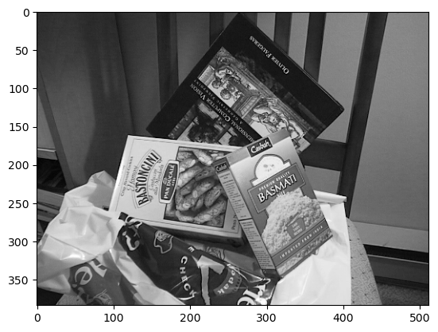
    


```python
base_image = generateBaseImage(image, sigma, assumed_blur) #variable 1
plt.imshow(base_image, cmap='gray')
plt.show()
```


    

    


```python

```

# Step 2: 
## Compute Octaves


```python
image_shape = base_image.shape
num_octaves = computeNumberOfOctaves(image_shape) #variable 2
num_octaves
```


    9


```python

```

# Step 3:
## Generating gaussian images


```python
gaussian_kernels # variable 3
```


    array([1.6       , 1.2262735 , 1.54500779, 1.94658784, 2.452547  ,
           3.09001559])


```python
gaussian_images = generateGaussianImages(base_image, num_octaves, gaussian_kernels) #Variable 4
```


```python
len(gaussian_images) * len(gaussian_images[0])
```


    54


```python
first_octave = gaussian_images[0]
```


```python
for i in first_octave:
    plt.imshow(i, cmap='gray')
    plt.show()
```


    

    


    

    


    

    


    
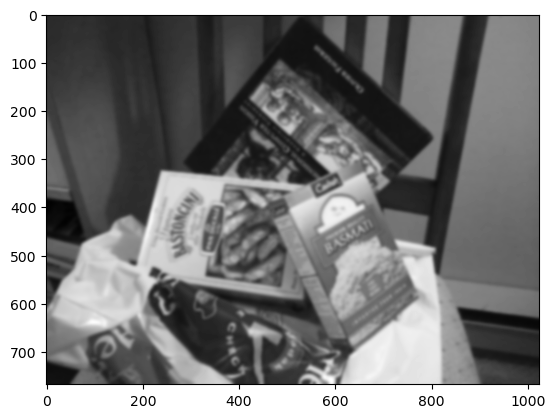
    


    

    


    

    


```python

```

# Step 6:
## Generating DoG


```python
dog_images = generateDoGImages(gaussian_images)  #variable 5
```


```python
len(dog_images) * len(dog_images[0])
```


    45


```python
first_octave_dog = dog_images[0]
```


```python
for i in first_octave_dog:
    plt.imshow(i, cmap='gray')
    plt.show()
```


    
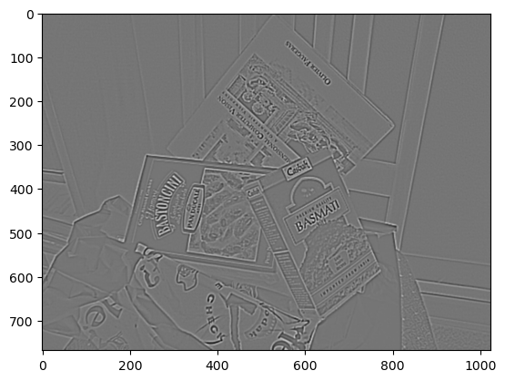
    


    
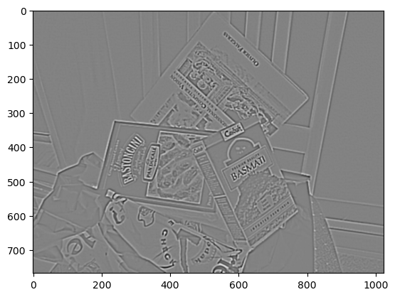
    


    
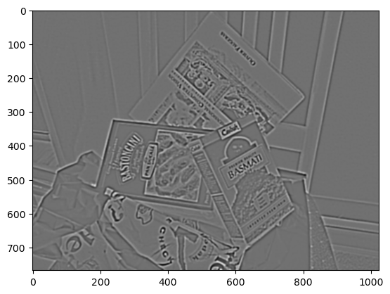
    


    
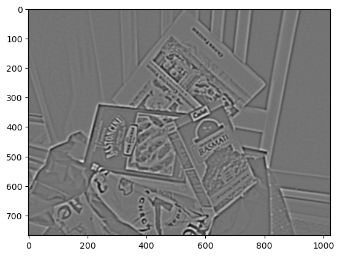
    


    
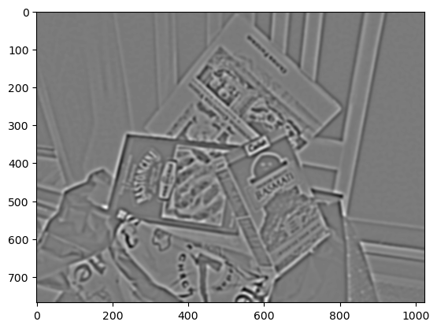
    


```python

```

# Step 7 :
## Finding keypoints


```python
start_time = time.time()

keypoints = findScaleSpaceExtrema(gaussian_images, dog_images, num_intervals, sigma, image_border_width, contrast_threshold=0.04) 

end_time = time.time()
elapsed_time = end_time - start_time
print("Time taken:", elapsed_time, "seconds")
```

    Time taken: 25.469006061553955 seconds


```python

```


```python

```


```python
kp2 = keypoints # variable 6b don't overwrite
```


```python
len(kp2)
```


    978


```python
keypoints = removeDuplicateKeypoints(keypoints) #variable 6b
keypoints = convertKeypointsToInputImageSize(keypoints) #variable 6c
```


```python

```


```python
kp2 = keypoints #variable 6
```


```python
# for k in kp2:
#     print(k.pt)
```


```python

```

# Step 7 : 
## Generating descriptors


```python
start_time = time.time()

#variable 7
descriptors = generateDescriptors(keypoints, gaussian_images, window_width=4, num_bins=8, scale_multiplier=3, descriptor_max_value=0.2)

end_time = time.time()
elapsed_time = end_time - start_time
print("Time taken:", elapsed_time, "seconds")

```

    Time taken: 36.80728077888489 seconds


```python
des2 = descriptors
```


```python
len(des2)
```


    966


```python

```


```python

```


```python

```


```python

```


```python

```


```python

```

## Now we have :


```python
# for k in kp1:  #keypoints for image 1
#     # print(k.pt)
```


```python
des1  # descriptors for image 1
```


    array([[150.,   0.,   0., ...,   1.,   0., 255.],
           [ 84.,   0.,   0., ..., 255.,   5.,  56.],
           [176.,   0.,   0., ...,   0.,   0.,   0.],
           ...,
           [255.,   0.,   0., ...,   0.,   0.,   0.],
           [ 17.,   1.,  43., ..., 255., 255., 255.],
           [255., 157.,   0., ...,  96., 255., 255.]], dtype=float32)


```python
# for k in kp2:  #keypoints for image 2
#     print(k.pt)
```


```python
des2  # descriptors for image 2
```


    array([[255., 255., 255., ...,  77.,   5.,  83.],
           [255., 106.,   0., ..., 255., 255., 255.],
           [ 74., 128., 255., ..., 255., 113., 255.],
           ...,
           [255., 255., 255., ..., 255., 255., 255.],
           [255., 255., 255., ..., 255., 255., 255.],
           [255., 255., 255., ...,   0.,   0., 255.]], dtype=float32)


```python
len(kp1)
```


    603


```python
len(des1)
```


    603


```python
len(kp2)
```


    966


```python
len(des2)
```


    966


```python

```


```python

```

# Step 8 : 


```python
MIN_MATCH_COUNT = 10
```


```python
start_time = time.time()

# Initialize and use FLANN
FLANN_INDEX_KDTREE = 0
index_params = dict(algorithm = FLANN_INDEX_KDTREE, trees = 5)
search_params = dict(checks = 50)
flann = cv2.FlannBasedMatcher(index_params, search_params)
matches = flann.knnMatch(des1, des2, k=2)

# Lowe's ratio test
good = []
for m, n in matches:
    if m.distance < 0.7 * n.distance:
        good.append(m)

if len(good) > MIN_MATCH_COUNT:
    # Estimate homography between template and scene
    src_pts = np.float32([ kp1[m.queryIdx].pt for m in good]).reshape(-1, 1, 2)
    dst_pts = np.float32([ kp2[m.trainIdx].pt for m in good]).reshape(-1, 1, 2)

    M = cv2.findHomography(src_pts, dst_pts, cv2.RANSAC, 5.0)[0]

    # Draw detected template in scene image
    h, w = img1.shape
    pts = np.float32([[0, 0],
                      [0, h - 1],
                      [w - 1, h - 1],
                      [w - 1, 0]]).reshape(-1, 1, 2)
    dst = cv2.perspectiveTransform(pts, M)

    img2 = cv2.polylines(img2, [np.int32(dst)], True, 255, 3, cv2.LINE_AA)

    h1, w1 = img1.shape
    h2, w2 = img2.shape
    nWidth = w1 + w2
    nHeight = max(h1, h2)
    hdif = int((h2 - h1) / 2)
    newimg = np.zeros((nHeight, nWidth, 3), np.uint8)

    for i in range(3):
        newimg[hdif:hdif + h1, :w1, i] = img1
        newimg[:h2, w1:w1 + w2, i] = img2

    # Draw SIFT keypoint matches
    for m in good:
        pt1 = (int(kp1[m.queryIdx].pt[0]), int(kp1[m.queryIdx].pt[1] + hdif))
        pt2 = (int(kp2[m.trainIdx].pt[0] + w1), int(kp2[m.trainIdx].pt[1]))
        cv2.line(newimg, pt1, pt2, (255, 0, 0))

    plt.imshow(newimg)
    plt.show()
else:
    print("Not enough matches are found - %d/%d" % (len(good), MIN_MATCH_COUNT))

end_time = time.time()
elapsed_time = end_time - start_time

print("Time taken:", elapsed_time, "seconds")
```


    
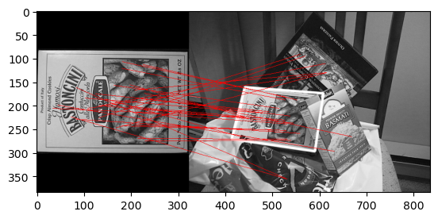
    


    Time taken: 0.16537094116210938 seconds


```python

```


```python
len(matches)
```


    603


```python
len(good)
```


    32


```python

```


```python

```


```python

```

# Check time


```python

```


```python
#time required for computing keypoints and descriptor for image 1a
start_time = time.time()


key1, desc1 = computeKeypointsAndDescriptors(img1, sigma=1.6, num_intervals=3, assumed_blur=0.5, image_border_width=5 )

end_time = time.time()
elapsed_time = end_time - start_time

print("Time taken:", elapsed_time, "seconds")
```

    Time taken: 36.38241505622864 seconds


```python
#time required for computing keypoints and descriptor for image 2a
start_time = time.time()


ikey1, idesc1 = computeKeypointsAndDescriptors(img1, sigma=1.6, num_intervals=3, assumed_blur=0.5, image_border_width=5 )

end_time = time.time()
elapsed_time = end_time - start_time

print("Time taken:", elapsed_time, "seconds")
```

    Time taken: 25.90845489501953 seconds


```python
#time required for computing keypoints and descriptor for image 1b
start_time = time.time()


key2, desc2 = computeKeypointsAndDescriptors(img2, sigma=1.6, num_intervals=3, assumed_blur=0.5, image_border_width=5 )

end_time = time.time()
elapsed_time = end_time - start_time

print("Time taken:", elapsed_time, "seconds")
```

    Time taken: 63.729933977127075 seconds


```python
#time required for computing keypoints and descriptor for image 2b
start_time = time.time()


ikey2, idesc2 = computeKeypointsAndDescriptors(img2, sigma=1.6, num_intervals=3, assumed_blur=0.5, image_border_width=5 )

end_time = time.time()
elapsed_time = end_time - start_time

print("Time taken:", elapsed_time, "seconds")
```

    Time taken: 48.91615104675293 seconds


```python
len(ikey1)
```


    328


```python
len(idesc1)
```


    328


```python
len(ikey2)
```


    529


```python
len(idesc2)
```


    529


```python

```


```python
start_time = time.time()

# Initialize and use FLANN
FLANN_INDEX_KDTREE = 0
index_params = dict(algorithm = FLANN_INDEX_KDTREE, trees = 5)
search_params = dict(checks = 50)
flann = cv2.FlannBasedMatcher(index_params, search_params)
matches = flann.knnMatch(idesc1, idesc2, k=2)

# Lowe's ratio test
good = []
for m, n in matches:
    if m.distance < 0.7 * n.distance:
        good.append(m)

if len(good) > MIN_MATCH_COUNT:
    # Estimate homography between template and scene
    src_pts = np.float32([ ikey1[m.queryIdx].pt for m in good]).reshape(-1, 1, 2)
    dst_pts = np.float32([ ikey2[m.trainIdx].pt for m in good]).reshape(-1, 1, 2)

    M = cv2.findHomography(src_pts, dst_pts, cv2.RANSAC, 5.0)[0]

    # Draw detected template in scene image
    h, w = img1.shape
    pts = np.float32([[0, 0],
                      [0, h - 1],
                      [w - 1, h - 1],
                      [w - 1, 0]]).reshape(-1, 1, 2)
    dst = cv2.perspectiveTransform(pts, M)

    img2 = cv2.polylines(img2, [np.int32(dst)], True, 255, 3, cv2.LINE_AA)

    h1, w1 = img1.shape
    h2, w2 = img2.shape
    nWidth = w1 + w2
    nHeight = max(h1, h2)
    hdif = int((h2 - h1) / 2)
    newimg = np.zeros((nHeight, nWidth, 3), np.uint8)

    for i in range(3):
        newimg[hdif:hdif + h1, :w1, i] = img1
        newimg[:h2, w1:w1 + w2, i] = img2

    # Draw SIFT keypoint matches
    for m in good:
        pt1 = (int(ikey1[m.queryIdx].pt[0]), int(ikey1[m.queryIdx].pt[1] + hdif))
        pt2 = (int(ikey2[m.trainIdx].pt[0] + w1), int(ikey2[m.trainIdx].pt[1]))
        cv2.line(newimg, pt1, pt2, (255, 0, 0))

    plt.imshow(newimg)
    plt.show()
else:
    print("Not enough matches are found - %d/%d" % (len(good), MIN_MATCH_COUNT))

end_time = time.time()
elapsed_time = end_time - start_time

print("Time taken:", elapsed_time, "seconds")
```


    
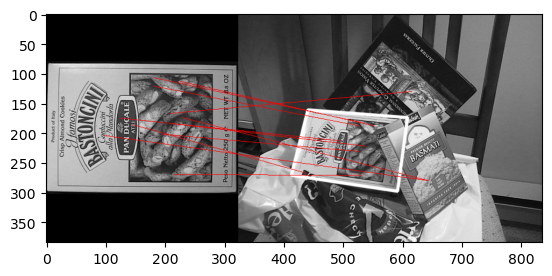
    


    Time taken: 0.212111234664917 seconds


```python
len(matches)
```


    328


```python
len(good)
```


    11


# try  different images


```python
image1 = cv2.imread('cookies.jpeg', cv2.IMREAD_GRAYSCALE)           # queryImage
image = image1.astype('float32')
plt.imshow(image, cmap='gray')
plt.show()
```


    
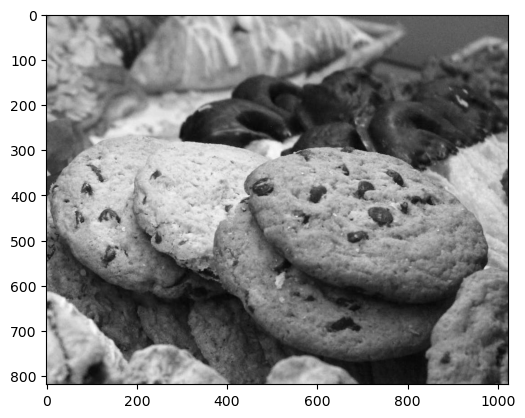
    


```python
image2 = cv2.imread('cookies_in_scene.jpeg', cv2.IMREAD_GRAYSCALE)           # queryImage
image = image2.astype('float32')
plt.imshow(image, cmap='gray')
plt.show()
```


    
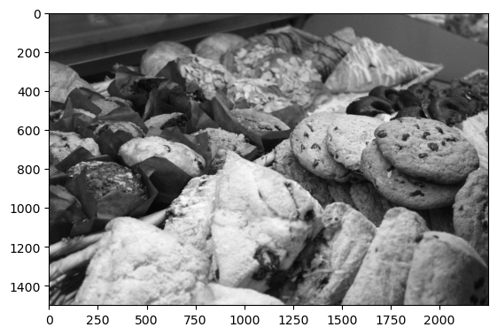
    


```python
#time required for computing keypoints and descriptor for image 1a
start_time = time.time()


key1, desc1 = computeKeypointsAndDescriptors(image1, sigma=1.6, num_intervals=3, assumed_blur=0.5, image_border_width=5 )

end_time = time.time()
elapsed_time = end_time - start_time

print("Time taken:", elapsed_time, "seconds")
```

    Time taken: 220.11827993392944 seconds


```python
#time required for computing keypoints and descriptor for image 2a
start_time = time.time()


nkey1, ndesc1 = computeKeypointsAndDescriptors(image1, sigma=1.6, num_intervals=3, assumed_blur=0.5, image_border_width=5 )

end_time = time.time()
elapsed_time = end_time - start_time

print("Time taken:", elapsed_time, "seconds")
```

    Time taken: 176.15339422225952 seconds


```python
#time required for computing keypoints and descriptor for image 1b
start_time = time.time()


key2, desc2 = computeKeypointsAndDescriptors(image2, sigma=1.6, num_intervals=3, assumed_blur=0.5, image_border_width=5 )

end_time = time.time()
elapsed_time = end_time - start_time

print("Time taken:", elapsed_time, "seconds")
```

    Time taken: 618.5622289180756 seconds


```python
#time required for computing keypoints and descriptor for image 2b
start_time = time.time()


nkey2, ndesc2 = computeKeypointsAndDescriptors(image2, sigma=1.6, num_intervals=3, assumed_blur=0.5, image_border_width=5 )

end_time = time.time()
elapsed_time = end_time - start_time

print("Time taken:", elapsed_time, "seconds")
```

    Time taken: 527.2414939403534 seconds


```python
tkp1 = key1
tdes1 = desc1
tkp2 = key2
tdes2 = desc2
```


```python

```


```python
len(tkp1)
```


    2920


```python
len(tdes1)
```


    2920


```python
len(tkp2)
```


    7176


```python
len(tdes2)
```


    7176


```python
len(nkey1)
```


    1922


```python
len(ndesc1)
```


    1922


```python
len(nkey2)
```


    4989


```python
len(ndesc2)
```


    4989


```python
start_time = time.time()

# Initialize and use FLANN
FLANN_INDEX_KDTREE = 0
index_params = dict(algorithm = FLANN_INDEX_KDTREE, trees = 5)
search_params = dict(checks = 50)
flann = cv2.FlannBasedMatcher(index_params, search_params)
matches = flann.knnMatch(tdes1, tdes2, k=2)

# Lowe's ratio test
good = []
for m, n in matches:
    if m.distance < 0.7 * n.distance:
        good.append(m)

if len(good) > MIN_MATCH_COUNT:
    # Estimate homography between template and scene
    src_pts = np.float32([ tkp1[m.queryIdx].pt for m in good]).reshape(-1, 1, 2)
    dst_pts = np.float32([ tkp2[m.trainIdx].pt for m in good]).reshape(-1, 1, 2)

    M = cv2.findHomography(src_pts, dst_pts, cv2.RANSAC, 5.0)[0]

    # Draw detected template in scene image
    h, w = image1.shape
    pts = np.float32([[0, 0],
                      [0, h - 1],
                      [w - 1, h - 1],
                      [w - 1, 0]]).reshape(-1, 1, 2)
    dst = cv2.perspectiveTransform(pts, M)

    img2 = cv2.polylines(image2, [np.int32(dst)], True, 255, 3, cv2.LINE_AA)

    h1, w1 = image1.shape
    h2, w2 = image2.shape
    nWidth = w1 + w2
    nHeight = max(h1, h2)
    hdif = int((h2 - h1) / 2)
    newimg = np.zeros((nHeight, nWidth, 3), np.uint8)

    for i in range(3):
        newimg[hdif:hdif + h1, :w1, i] = image1
        newimg[:h2, w1:w1 + w2, i] = image2

    # Draw SIFT keypoint matches
    for m in good:
        pt1 = (int(tkp1[m.queryIdx].pt[0]), int(tkp1[m.queryIdx].pt[1] + hdif))
        pt2 = (int(tkp2[m.trainIdx].pt[0] + w1), int(tkp2[m.trainIdx].pt[1]))
        cv2.line(newimg, pt1, pt2, (255, 0, 0))

    plt.imshow(newimg)
    plt.show()
else:
    print("Not enough matches are found - %d/%d" % (len(good), MIN_MATCH_COUNT))

end_time = time.time()
elapsed_time = end_time - start_time

print("Time taken:", elapsed_time, "seconds")
```


    
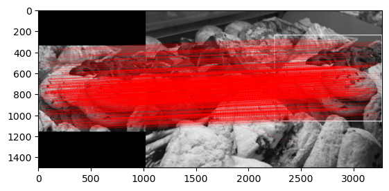
    


    Time taken: 1.0640671253204346 seconds


```python
len(matches)
```


    2920


```python
len(good)
```


    1546


```python
start_time = time.time()

# Initialize and use FLANN
FLANN_INDEX_KDTREE = 0
index_params = dict(algorithm = FLANN_INDEX_KDTREE, trees = 5)
search_params = dict(checks = 50)
flann = cv2.FlannBasedMatcher(index_params, search_params)
matches = flann.knnMatch(ndesc1, ndesc2, k=2)

# Lowe's ratio test
good = []
for m, n in matches:
    if m.distance < 0.7 * n.distance:
        good.append(m)

if len(good) > MIN_MATCH_COUNT:
    # Estimate homography between template and scene
    src_pts = np.float32([ nkey1[m.queryIdx].pt for m in good]).reshape(-1, 1, 2)
    dst_pts = np.float32([ nkey2[m.trainIdx].pt for m in good]).reshape(-1, 1, 2)

    M = cv2.findHomography(src_pts, dst_pts, cv2.RANSAC, 5.0)[0]

    # Draw detected template in scene image
    h, w = image1.shape
    pts = np.float32([[0, 0],
                      [0, h - 1],
                      [w - 1, h - 1],
                      [w - 1, 0]]).reshape(-1, 1, 2)
    dst = cv2.perspectiveTransform(pts, M)

    img2 = cv2.polylines(image2, [np.int32(dst)], True, 255, 3, cv2.LINE_AA)

    h1, w1 = image1.shape
    h2, w2 = image2.shape
    nWidth = w1 + w2
    nHeight = max(h1, h2)
    hdif = int((h2 - h1) / 2)
    newimg = np.zeros((nHeight, nWidth, 3), np.uint8)

    for i in range(3):
        newimg[hdif:hdif + h1, :w1, i] = image1
        newimg[:h2, w1:w1 + w2, i] = image2

    # Draw SIFT keypoint matches
    for m in good:
        pt1 = (int(nkey1[m.queryIdx].pt[0]), int(nkey1[m.queryIdx].pt[1] + hdif))
        pt2 = (int(nkey2[m.trainIdx].pt[0] + w1), int(nkey2[m.trainIdx].pt[1]))
        cv2.line(newimg, pt1, pt2, (255, 0, 0))

    plt.imshow(newimg)
    plt.show()
else:
    print("Not enough matches are found - %d/%d" % (len(good), MIN_MATCH_COUNT))

end_time = time.time()
elapsed_time = end_time - start_time

print("Time taken:", elapsed_time, "seconds")
```


    

    


    Time taken: 0.8455202579498291 seconds


```python
len(matches)
```


    1922


```python
len(good)
```


    1092


```python

```


```python

```
